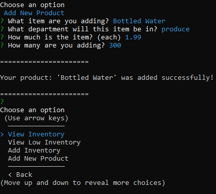

# Bamazon

This is a fake shopping app made for Node with MySQL.

At the start you are presented with two options...

- Bamazon Customer
- Bamazon Manager

## Bamazon Customer

Choosing `Bamazon Customer` sends you to a screen showing you the current inventory and asks if you want to purchase something.

Choosing `n` sends you back to the welcome screen, but choosing `Y` will send you through a set of prompts asking which item you want to buy and how many. You are then told your total, the table is updated in the database, and you're asked again if you want to buy something.

## Bamazon Manager

The `Bamazon Manager` menu is a little more interesting and interactive. You have 4 options in this menu...

- View Inventory
- View Low Inventory
- Add Inventory
- Add New Product

Also included are `< Back` and `End Connection` options.

- `< Back` takes you to the welcome screen
- `End Connection` ends the program (this is under `< Back` in the picture)

`View Inventory` just shows you the current inventory in the database and sends you back to the manager menu.

`View Low Inventory` shows all items with quantities under 20 and, again, sends you back to the manager menu. (I changed some quantities to show this functionality).

`Add Inventory` shows the current inventory and prompts the user asking if they want to and to the inventory.

Choosing `n` takes you back to the manager menu, while choosing `Y` sends you through questions asking which item to add to and how many to add.

If you view the inventory again you can see the changes were made successfully.

The last option `Add New Product` lets you, well, add a new product. You're asked the item's name, which department it will be added to, its per each price and the quantity to add to inventory. You're then given a confirmation message saying your item was added.

And if we view the inventory once more you can see the new item added to the bottom of the list.

